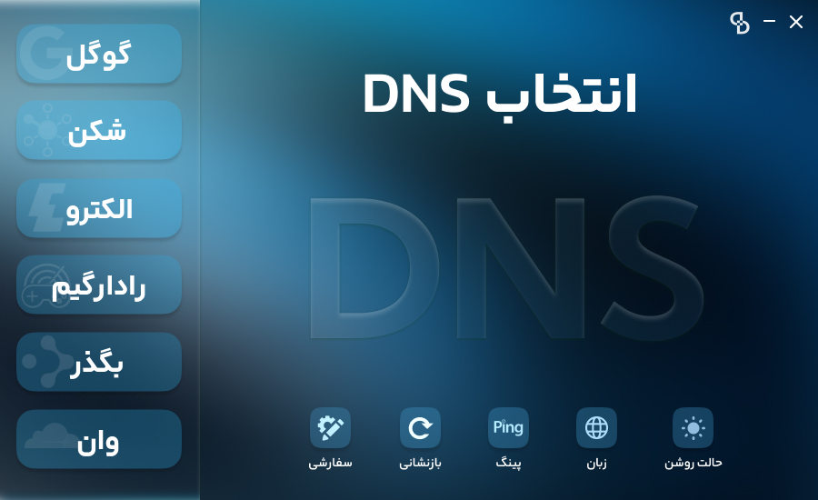
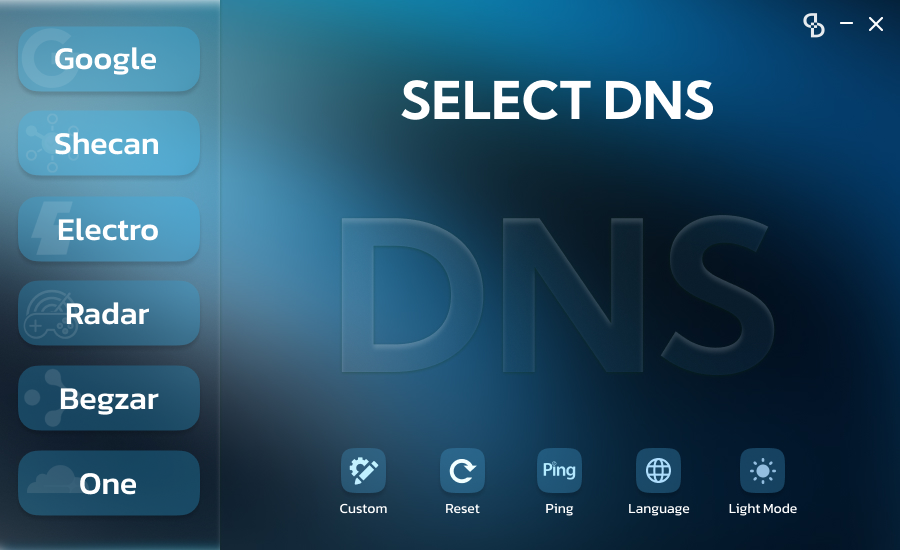

# 🌐 DDNS - Demureytion DNS

برنامه‌ای سبک، قابل حمل و بدون نیاز به نصب برای تغییر سریع DNS و **رفع تحریم‌های اینترنتی** در ویندوز.

---

## ✨ ویژگی‌ها

✅ تغییر سریع DNS فقط با یک کلیک  
✅ رفع محدودیت و تحریم سرویس‌های بین‌المللی  
✅ پشتیبانی از DNSهای عمومی و ضدتحریم:

- Google
- Cloudflare (1.1.1.1)
- **Shecan** (ضدتحریم)
- **Electeo** (ضدتحریم)
- **Radar** (ضدتحریم)
- **Begzar** (ضدتحریم)

✅ پشتیبانی از DNS سفارشی  
✅ نمایش زنده پینگ DNS فعال  
✅ دو تم **تاریک و روشن**  
✅ رابط کاربری گرافیکی اختصاصی  
✅ زبان‌های **فارسی** و **انگلیسی**  
✅ بدون نیاز به نصب یا پیش‌نیاز اضافی  
✅ مناسب برای اجرا از فلش مموری

---

## 🔐 رفع تحریم چیست؟

بعضی از سرویس‌های اینترنتی و بازی ها مانند Adobe، Google، steem و... به دلیل تحریم‌ها برای کاربران ایرانی محدود شده‌اند. DNSهایی مثل Shecan، Electeo، Radar و Begzar با استفاده از سرورهای داخلی این محدودیت‌ها را دور زده و امکان دسترسی به این سرویس‌ها را فراهم می‌کنند.

---

## 🖼 پیش‌نمایش

> 

---

## ⚙️ پیش‌نیازها

- ویندوز 7، 8، 10 یا 11
- اجرای برنامه با دسترسی **Administrator**

---

## 📦 نحوه اجرا

1. آخرین نسخه برنامه را از [بخش Releases](https://github.com/AliM0radi/DDNS/releases) دریافت کنید.
2. فایل `.exe` را اجرا کرده و در صورت نیاز گزینه‌ی **Run as Administrator** را انتخاب کنید.
3. از بین DNSهای آماده یکی را انتخاب کنید، یا DNS دلخواه خود را وارد نمایید.

---

## 🧑‍💻 توسعه‌دهنده

- طراحی و پیاده‌سازی: **M.M.Alimoradi**  
- رابط کاربری طراحی‌شده با: **Figma**

---

## 📝 مجوز

این پروژه تحت لایسنس MIT منتشر شده و استفاده‌ی شخصی و عمومی از آن آزاد است.

---

# EN

# 🌐 DDNS - Demureytion DNS

A lightweight, portable, and installation-free tool for **quickly switching DNS** and **bypassing internet sanctions** on Windows.

---

## ✨ Features

✅ One-click DNS switching  
✅ Bypass internet restrictions and sanctions  
✅ Support for public and anti-censorship DNS servers:

- Google
- Cloudflare (1.1.1.1)
- **Shecan** (Anti-censorship)
- **Electeo** (Anti-censorship)
- **Radar** (Anti-censorship)
- **Begzar** (Anti-censorship)

✅ Add custom DNS manually  
✅ Live ping monitoring of active DNS  
✅ Light and dark themes  
✅ Clean and modern GUI with custom graphics  
✅ Supports **English** and **Persian** languages  
✅ No installation or prerequisites needed  
✅ Portable (can be run from USB drives)

---

## 🔐 What is DNS-based Sanction Bypass?

Some websites, services, and games such as **Adobe**, **Google**, **Steam**, and others are blocked or restricted for Iranian users due to sanctions. DNS providers like Shecan, Electeo, Radar, and Begzar use internal routing to make these services accessible, bypassing the restrictions and improving the browsing experience for Iranian users.

---

## 🖼 Screenshots

> 

---

## ⚙️ Requirements

- Windows 7, 8, 10, or 11  
- Run with **Administrator privileges** (required to change DNS settings)

---

## 📦 How to Use

1. Download the latest version from the [Releases](https://github.com/AliM0radi/DDNS/releases) section.  
2. Run the `.exe` file (preferably as **Administrator**).  
3. Choose a predefined DNS or enter your own custom DNS values.

---

## 🧑‍💻 Developer

- Designed and developed by: **M.M.Alimoradi**  
- UI designed with: **Figma**

---

## 📝 License

This project is released under the **MIT License**.  
You are free to use, modify, and distribute it.
